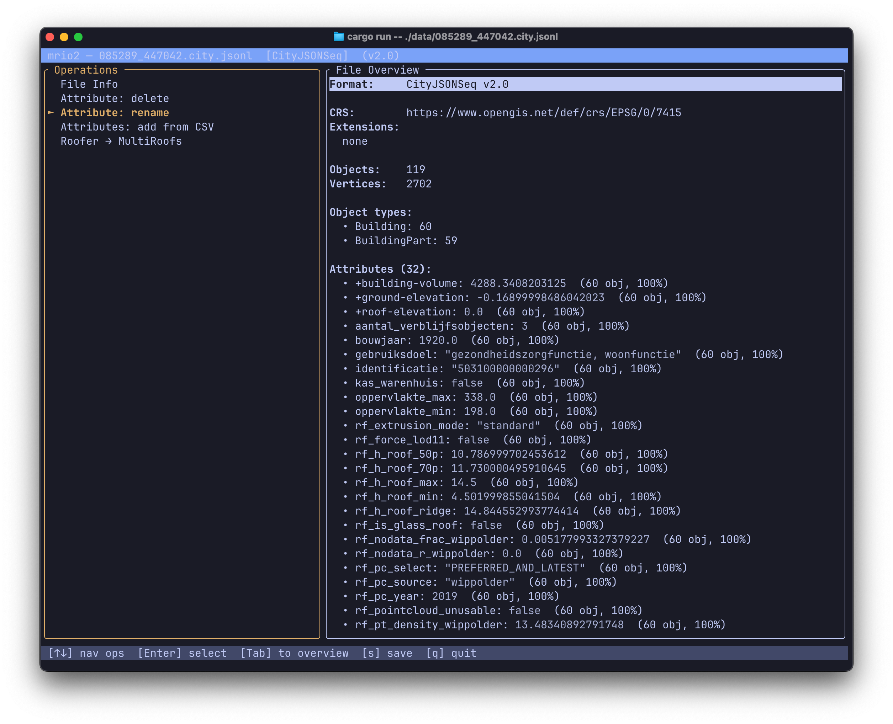

# mrio2

Reads, modifies, and writes [CityJSON](https://www.cityjson.org/specs/2.0.2/) and [CityJSONSeq](https://www.cityjson.org/specs/2.0.2/#text-sequences-and-streaming-with-cityjsonfeature) files for the [MultiRoofs](https://github.com/multiroofs) project.

Available as both a terminal UI (TUI) and a web application.

## Build & run

Requires [Rust](https://rustup.rs/) 1.81+.

### Terminal UI (TUI)

```sh
cargo build --release
cargo run -p mrio2-cli -- data/3dbag_b2.city.json
cargo run -p mrio2-cli -- data/3dbag_b2.city.jsonl --output-format cityjson   # format conversion
```



**Usage:**
- **Open a file**: `cargo run -p mrio2-cli -- <file>`
- **Operations**: select from the left panel with `↑↓`, press `Enter`
- **Save**: press `s`, type output path, `f` toggles output format (CityJSON / CityJSONSeq)
- **Quit**: `q` (confirms if unsaved)

### Web application

Requires [wasm-pack](https://rustwasm.github.io/wasm-pack/installer/) for building the WebAssembly module.

```sh
# Build the WASM module
wasm-pack build crates/mrio2-web --target web --out-dir ../../web/pkg

# Serve the web app (any static file server works)
python3 -m http.server 8080 --directory web
```

Then open http://localhost:8080 in your browser.

**Usage:**
- **Open a file**: drag and drop a `.city.json` or `.city.jsonl` file onto the page, or click to browse
- **Operations**: click buttons in the left panel, follow dialogs
- **Download**: click the Download button to save the modified file
- **Reset**: click "Load different file" at the bottom of the left panel to return to the start screen

## Operations

| Operation | What it does |
|-----------|-------------|
| Attribute: delete | Pick an attribute name from the list → removes it from all CityObjects |
| Attribute: rename | Pick an attribute, type a new name → renames it everywhere |
| Attributes: add from CSV | Load a CSV (first column = CityObject ID, headers = attribute names) and add those attributes to matching objects. Accepts `;` or `,` delimiters (auto-detected). |
| Validate schema | Runs `cjval` against the file: checks JSON syntax, schema conformance, extension schemas (fetched from URLs), parent-child consistency, vertex indices, semantics arrays, textures, materials, and warns about extra root properties, duplicate/unused vertices. |
| Roofer → MultiRoofs | Merges all `BuildingPart` objects into their parent `Building`, removes lod=0 geometry, renames `b3_volume` → `+building-volume`, computes total roof surface area → `+roof-total-area`, and adds the `multiroofs` extension. |
## Formats

All operators accept CityJSON (`.json`) and CityJSONSeq (`.jsonl`) as input and output.

| Format | Extension | Description |
|--------|-----------|-------------|
| CityJSON | `.city.json` | Single JSON object with all CityObjects and vertices |
| CityJSONSeq | `.city.jsonl` | Streaming format: header line + one CityJSONFeature per line |

[CityJSON specification 2.0.2](https://www.cityjson.org/specs/2.0.2/)

## License

MIT
